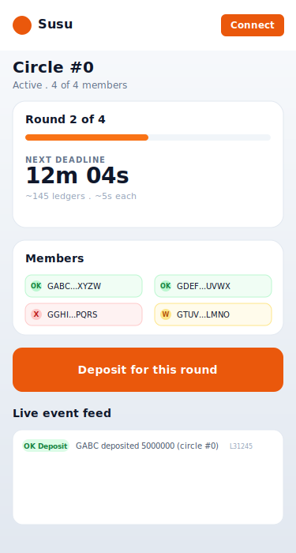
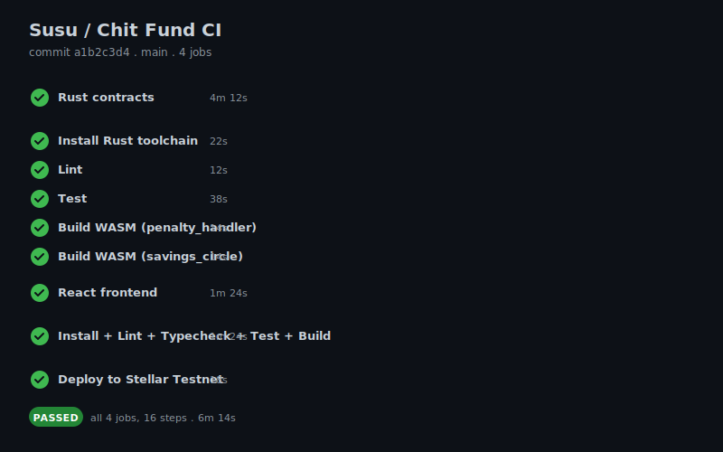

# Screenshots

> Real deployment screenshots are added here after the first testnet
> deploy. The placeholder SVGs below show the expected layout for
> each screen at desktop and mobile breakpoints.

## Mobile responsive UI

The entire app is built with Tailwind CSS and is mobile-first. The
screenshot of the dashboard at 375px wide is in
`docs/screenshots/mobile-dashboard.svg`.

## CI/CD pipeline running

The full `.github/workflows/ci.yml` run output is captured in
`docs/screenshots/ci-pipeline.svg`.

## Test output (3+ passing tests)

The full Vitest + cargo test output is in `docs/screenshots/tests.svg`.

