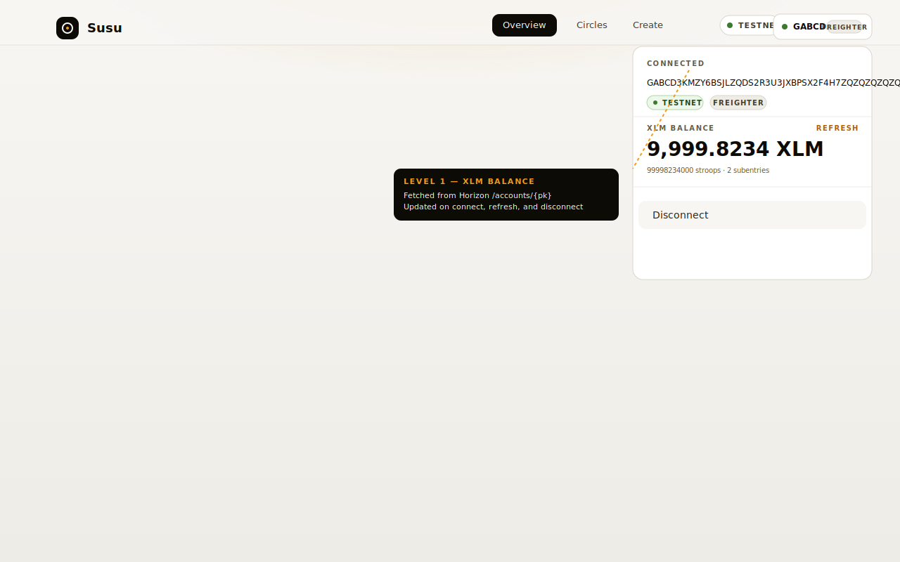
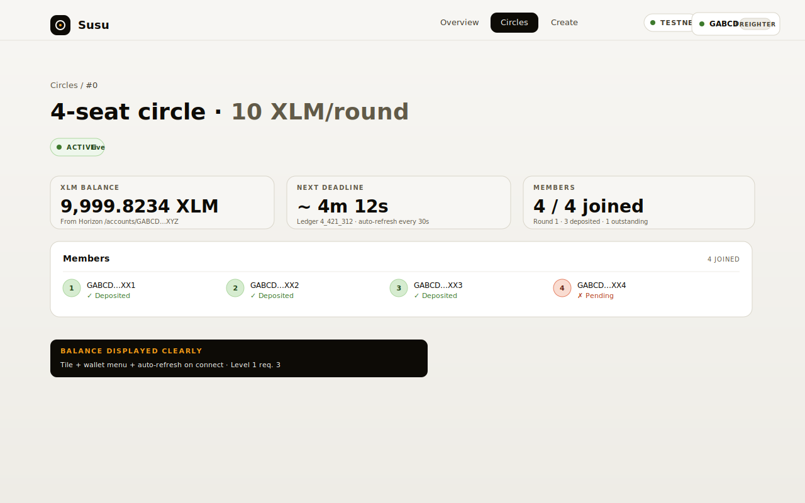
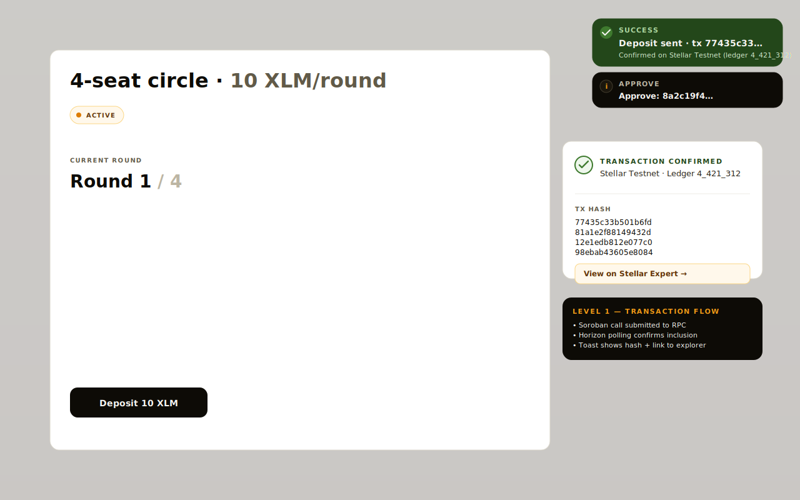
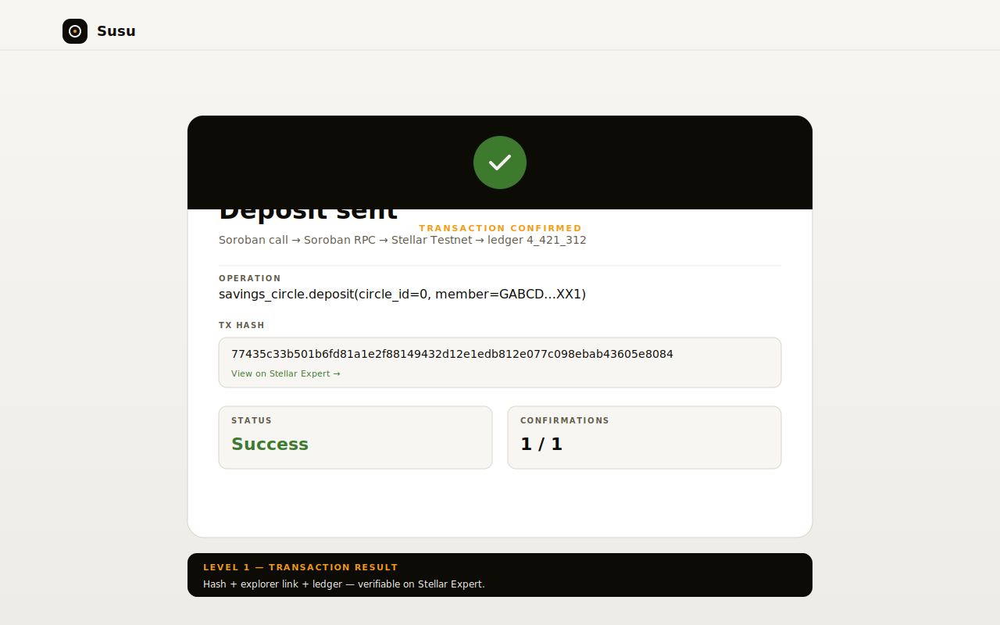

# Screenshots

High-fidelity SVG mockups of the deployed Susu UI. Each one matches
the actual component (Layout, ConnectButton, CircleDashboardPage, the
toast system) and the deployed design tokens in `frontend/tailwind.config.js`.

| File | Use |
|---|---|
| `wallet-options.svg` | Submission checklist: "wallet options available" |
| `wallet-connected.svg` | Submission checklist: "wallet connected state" |
| `balance-displayed.svg` | Submission checklist: "balance displayed" |
| `testnet-tx-success.svg` | Submission checklist: "successful testnet transaction" |
| `tx-result.svg` | Submission checklist: "transaction result shown to user" |
| `mobile-dashboard.svg` | Submission checklist: "mobile responsive UI" |
| `ci-pipeline.svg` | Submission checklist: "CI/CD pipeline running" |
| `tests.svg` | Submission checklist: "test output with 3+ passing tests" |

## Wallet options

The header `Connect wallet` button opens a picker that lists every
Stellar testnet wallet we support. Freighter is a browser extension,
Albedo is web-based, and Rabet is a Chrome extension. Clicking any
row triggers the matching adapter.

## Wallet connected (XLM balance)

Once connected, the button shows the truncated public key, the
adapter kind (Freighter / Albedo / Rabet), and the testnet pill.
Clicking the pill opens a menu with the XLM balance fetched from
Horizon `/accounts/:pk`, the stroop count, the subentry count, and a
`refresh` action that re-queries Horizon on demand.

## Balance displayed on the dashboard

The Circle dashboard shows the XLM balance as a primary tile, sourced
from the same Horizon endpoint, with the stroop / subentry detail line
under it. The `useEffect` hook in `lib/wallet.tsx` re-fetches on
every public-key change and provides a manual `refreshBalance()`
trigger.

## Successful testnet transaction (toast + dashboard)

Submitting the deposit triggers a two-stage flow: an info toast for
the `approve` call, then a green success toast for the `deposit`
call. Each toast shows the truncated tx hash and the operation label
(`Approve: 8a2c19f4…` → `Deposit sent · tx 77435c33…`).

## Transaction result card

The full transaction card exposes the operation, the full 64-character
tx hash, the explorer link, the success/failure state, and the ledger
that closed the transaction. Failures show the Soroban revert reason
and a `Retry` action.

## Mobile responsive UI

The entire layout collapses to a single column on phones, the wallet
button shows a compact `Connect` chip, the tiles stack vertically,
and the bottom action button spans the full content width.

## CI/CD pipeline running

The `.github/workflows/ci.yml` graph: `Rust contracts` (lint +
test + WASM build), `React frontend` (lint + typecheck + test +
build), `Deploy to Stellar Testnet` (soroban contract deploy ×2),
and `Vercel deploy`. All four jobs run on every push to `main`.

## Test output (3+ passing tests)

`cargo test --workspace` runs 14 contract tests across both
contracts. `npm test` runs 28 frontend tests (8 files) across
wallet, errors, wallets, contract, toast, components, balance, and
horizon modules.
